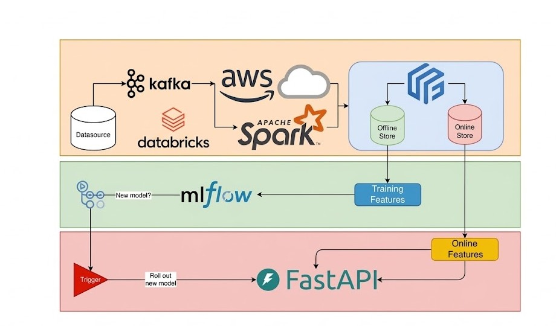

# Customer Churn Fullstack App

A full-stack customer churn prediction platform built with **FastAPI**, **React**, and **PostgreSQL**. The application supports real-time churn scoring, prediction history tracking, batch CSV processing, and AI-assisted retention insights for decision-ready customer success workflows.


## 🏗️ System Architecture




## 📁 Project Structure

```text
backend/
  core/
  database/
  models/
  routers/
  schemas/
  services/
  utils/
  main.py

frontend/
  src/
    api/
    components/
    pages/

docker-compose.yml
requirements.txt
sample_batch_input.csv
```

## ✨ Features

- Single-customer prediction
- Prediction from stored PostgreSQL customer records
- Prediction history persistence
- Batch CSV validation and scoring
- Databricks model serving integration
- Gemini retention recommendation with fallback strategy
- Risk level and top churn-driver analytics

## 🛠️ Tech Stack

### Backend

- FastAPI
- SQLAlchemy
- Pydantic
- PostgreSQL
- Uvicorn

### Frontend

- React
- Vite
- Fetch API

### External Services

- Databricks Model Serving
- Gemini API

## ⚙️ Backend

The backend is organized around a service-oriented FastAPI architecture:

- `routers/`: REST endpoints for health checks, predictions, and customer workflows
- `services/`: feature engineering, scoring, CSV parsing, analytics, Databricks integration, Gemini insight generation, and customer logic
- `models/`: SQLAlchemy ORM entities for `customers` and `predictions`
- `schemas/`: Pydantic request and response models
- `core/`: environment-based application settings
- `database/`: engine, session management, and database bootstrap
- `utils/`: shared constants and helper utilities

### Main API Endpoints

- `GET /api/health`
- `GET /api/customers`
- `GET /api/customers/{customer_id}`
- `PUT /api/customers/{customer_id}`
- `GET /api/customers/{customer_id}/predictions`
- `POST /api/customers/{customer_id}/predict`
- `POST /api/predictions/single`
- `POST /api/predictions/batch`

## 🎨 Frontend

The frontend preserves the original three user flows and presents them in a tab-based dashboard:

- `Single Prediction`
- `Predict From Database`
- `Batch Prediction`

The client communicates with the backend through `frontend/src/api/client.js` and defaults to `http://localhost:8000/api` unless `VITE_API_BASE_URL` is provided.

## 🚀 Local Setup

### 1. Install Backend Dependencies

```bash
pip install -r requirements.txt
```

### 2. Install Frontend Dependencies

```bash
cd frontend
npm install
```

## ▶️ Run Locally

### Start the Backend

```bash
uvicorn backend.main:app --reload
```

The API will be available at `http://localhost:8000`.

### Start the Frontend

```bash
cd frontend
npm run dev
```

The Vite app will typically run at `http://localhost:5173`.

## 🔐 Environment Variables

Use the existing `.env` file for Databricks, Gemini, PostgreSQL, and pgAdmin configuration. Recommended variables:

```env
DATABRICKS_URL=
DATABRICKS_TOKEN=
DATABRICKS_TIMEOUT=30

GEMINI_API_KEY=
GEMINI_MODEL=gemini-2.5-flash
GEMINI_TIMEOUT=15

POSTGRES_HOST=localhost
POSTGRES_PORT=5432
POSTGRES_DB=churn_db
POSTGRES_USER=admin
POSTGRES_PASSWORD=admin

PGADMIN_DEFAULT_EMAIL=
PGADMIN_DEFAULT_PASSWORD=

DISABLE_OUTBOUND_PROXY=true
VITE_API_BASE_URL=http://localhost:8000/api
```

## 🧪 Usage

### Single Prediction

Use the `Single Prediction` tab to submit one customer profile and receive:

- churn prediction output
- risk-level assessment
- top churn-driver analytics
- retention recommendation insight

### Predict From Database

Use the `Predict From Database` tab to:

- load customers stored in PostgreSQL
- run predictions for a selected customer
- persist prediction history for later review

### Batch Prediction

Use the `Batch Prediction` tab to upload a CSV file for bulk validation and scoring.

You can use [`sample_batch_input.csv`](./sample_batch_input.csv) as a reference input file.

## 🔄 Prediction Lifecycle

1. A user submits customer data from the React UI.
2. FastAPI validates the payload with Pydantic schemas.
3. The service layer prepares model-ready features.
4. The prediction service sends the request to the configured scoring pipeline.
5. Analytics and retention insight services enrich the raw prediction result.
6. For database-based predictions, the result is stored in PostgreSQL history.
7. The frontend renders the final output for review.

## 🐳 Docker

`docker-compose.yml` provisions the supporting database services for local development:

- PostgreSQL
- pgAdmin

Start them with:

```bash
docker compose up -d
```

Default service ports:

- PostgreSQL: `5432`
- pgAdmin: `5050`

## ✅ Testing

Run the backend test suite with:

```bash
pytest
```
