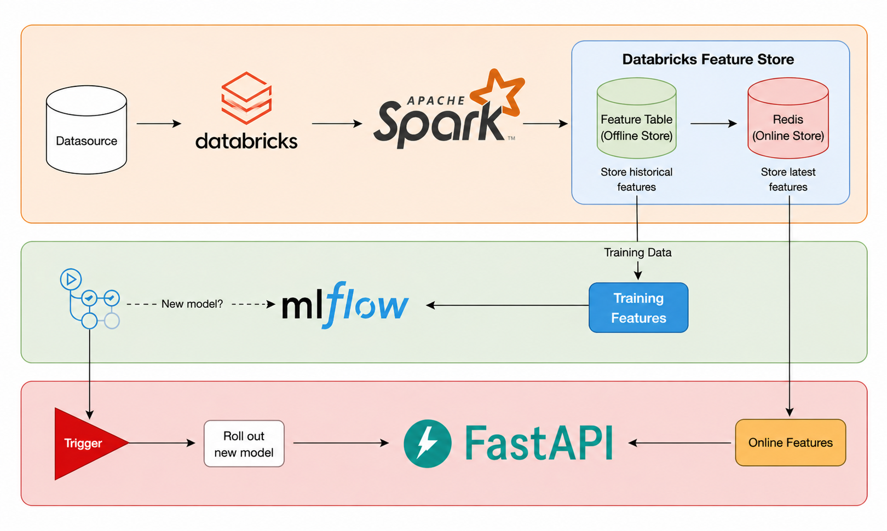
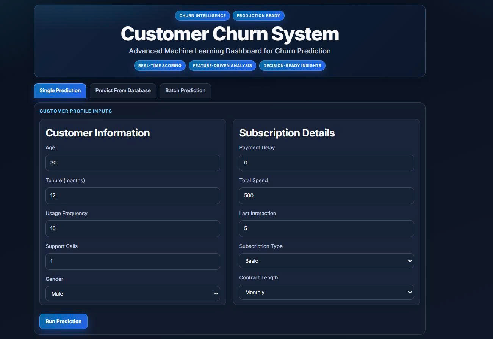
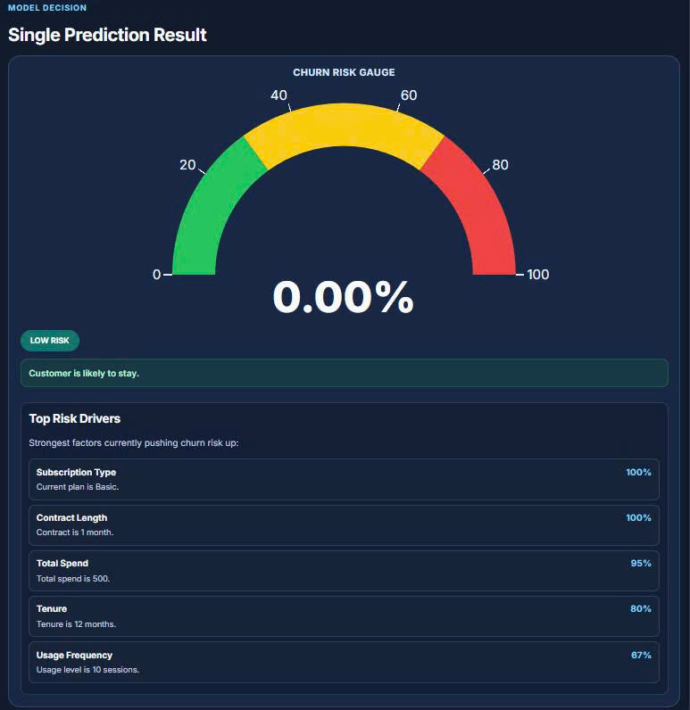

# 🚀 Customer Churn Prediction System

## 📌 Overview

A full-stack **Customer Churn Prediction** application built with modern data engineering practices. The system predicts customer churn probability using an XGBoost model served via **Databricks Model Serving**, with a complete data pipeline for data ingestion, preprocessing, and storage in **Redis**.

### What the Project Does
- Predicts customer churn probability (0–100%) for individual customers
- Supports batch prediction from CSV files
- Retrieves and scores customers stored in Redis database
- Provides churn driver analytics (top risk factors per prediction)
- Tracks prediction history for each customer

### Business Problem Solved
- Identifies at-risk customers before they churn
- Enables proactive retention strategies
- Provides actionable insights into churn drivers

### Data Sources
| Source | Description |
|--------|-------------|
| **CSV Input** | Batch customer data via CSV upload |
| **Redis Database** | Customer records stored for database prediction |
| **Fake Data Generator** | Synthetic data generation for testing |

### Final Output
- Churn prediction (binary: Churn / No Churn)
- Churn probability (0–100%)
- Risk level (LOW / MEDIUM / HIGH)
- Top 5 churn risk drivers with explanations
- Prediction history per customer

---

## 🏗 Architecture



## 🔄 Data Pipeline

### 1. Extract / Ingest
- **Fake Data Generator** (`data_pipeline/fake_data.py`): Generates synthetic customer records with realistic patterns and intentional "dirty data" (missing values, outliers, inconsistent casing)
- **CSV Upload**: Batch prediction accepts CSV files with customer attributes

### 2. Transform
- **Preprocessing** (`data_pipeline/processed.py`):
  - Deduplication based on CustomerID
  - Missing value imputation (median for numeric, mode for categorical)
  - Text normalization (lowercase + capitalize)
  - Label encoding for categorical columns
  - Outlier handling (Age: 18–90, Payment Delay: 0–120 days)
  - Negative spend correction

### 3. Load
- **Redis Import** (`data_pipeline/redis_importer.py`): Stores processed customer records in Redis with key pattern `customer:{customer_id}`

### 4. Orchestration
- **Manual Pipeline Execution**: `python data_pipeline/main.py` runs the full ETL pipeline
- **Backend API**: FastAPI handles prediction requests with built-in feature engineering

### 5. Data Quality / Validation
- Input validation in `feature_service.py` ensures all required fields are present
- Type coercion and error handling for invalid data
- Outlier capping to prevent model degradation

### 6. Analytics / Dashboard
- **Risk Level Classification**: LOW (< 30%), MEDIUM (30–70%), HIGH (> 70%)
- **Churn Driver Analytics**: Identifies top 5 risk factors per prediction with explanations

---

## 🛠 Tech Stack


| Category | Technology |
|----------|------------|
| **Backend** | FastAPI, Pydantic, Uvicorn |
| **Frontend** | React 18, Vite |
| **Database** | Redis |
| **ML Model** | XGBoost (trained in notebooks) |
| **ML Serving** | Databricks Model Serving |
| **Data Processing** | Pandas, Scikit-learn |
| **Containerization** | Docker, Docker Compose |

---

## 📂 Project Structure

```
churn-prediction/
├── backend/                    # FastAPI backend
│   ├── core/                  # Configuration (settings)
│   ├── database/              # Redis client
│   ├── models/                # Domain models (Customer, Prediction)
│   ├── routers/               # API endpoints (customers, predictions, health)
│   ├── schemas/               # Pydantic request/response models
│   ├── services/              # Business logic
│   │   ├── analytics_service  # Risk level & driver analysis
│   │   ├── csv_service        # CSV parsing for batch prediction
│   │   ├── customer_service   # Customer CRUD operations
│   │   ├── databricks_service # Databricks API integration
│   │   ├── feature_service    # Feature engineering
│   │   └── prediction_service # Prediction orchestration
│   ├── utils/                 # Constants and helpers
│   ├── main.py                # FastAPI app entry point
│   └── dockerfile
│
├── frontend/                  # React frontend
│   ├── src/
│   │   ├── api/              # API client
│   │   ├── components/       # Reusable UI components
│   │   └── pages/            # Page views (Single, Batch, Database prediction)
│   ├── dockerfile
│   └── vite.config.js
│
├── data_pipeline/            # ETL pipeline
│   ├── fake_data.py          # Synthetic data generation
│   ├── processed.py          # Data preprocessing & cleaning
│   ├── redis_importer.py    # Redis data import
│   └── main.py               # Pipeline orchestration
│
├── notebooks/                 # Jupyter notebooks
│   ├── EDA.ipynb             # Exploratory Data Analysis
│   ├── offline_features.ipynb# Feature engineering experiments
│   └── train_model.ipynb     # XGBoost model training
│
├── docker-compose.yml        # Multi-container orchestration
├── requirements.txt          # Root dependencies
└── sample_batch_input.csv   # Sample batch input file
```

### Key Components

| Component | Purpose |
|-----------|---------|
| `backend/routers/` | REST API endpoints for prediction |
| `backend/services/feature_service.py` | Feature engineering (17 derived features) |
| `backend/services/databricks_service.py` | Integration with Databricks Model Serving |
| `backend/services/analytics_service.py` | Risk classification and driver analysis |
| `data_pipeline/` | End-to-end ETL pipeline for data ingestion |

---

## ⚙️ How to Run

### Prerequisites
- Docker & Docker Compose
- Python 3.12+ (for local development)
- Redis instance
- Databricks workspace (for ML model serving)

### Setup Instructions

#### 1. Clone Repository
```bash
git clone <repository-url>
cd churn-prediction
```

#### 2. Configure Environment
Create a `.env` file in the root directory:

```env
# Databricks Configuration
DATABRICKS_URL=https://<your-workspace>.cloud.databricks.com/model/serving-endpoints/<endpoint-name>/invocations
DATABRICKS_TOKEN=<your-databricks-token>
DATABRICKS_TIMEOUT=30
DATABRICKS_RETRY_ATTEMPTS=2

# Redis Configuration
REDIS_HOST=localhost
REDIS_PORT=6379
REDIS_USERNAME=<username>
REDIS_PASSWORD=<password>
REDIS_DB=0

# Proxy Configuration
DISABLE_OUTBOUND_PROXY=false
```

#### 3. Run with Docker Compose
```bash
docker-compose up --build
```

- **Backend API**: http://localhost:8000
- **Frontend UI**: http://localhost:3000
- **API Docs**: http://localhost:8000/docs

#### 4. Run Data Pipeline (Optional)
```bash
cd data_pipeline
python main.py
```

This generates fake customer data, preprocesses it, and imports to Redis.

#### 5. Run Batch Prediction
Upload `sample_batch_input.csv` via the Frontend UI at http://localhost:3000/batch

---

## 📊 Results / Output

<div align="center">
  
  
</div>

<p align="center">
  <b>UI Dashboard</b> &nbsp;&nbsp;&nbsp;&nbsp;&nbsp;&nbsp;&nbsp;&nbsp;&nbsp;&nbsp;&nbsp;&nbsp;&nbsp;&nbsp;&nbsp;
  <b>Prediction Result</b>
</p>

---

## 💡 Key Learnings

- **Feature Engineering**: Created 17 derived features (e.g., `usage_per_tenure`, `engagement_score`) to improve model performance
- **API Integration**: Built robust integration with Databricks Model Serving with retry logic and error handling
- **Data Pipeline Design**: Implemented complete ETL pipeline with data quality checks (missing values, outliers, deduplication)
- **Real-time vs Batch**: Supported both real-time single prediction and batch CSV processing
- **Containerization**: Dockerized both frontend and backend services with Docker Compose orchestration

---
